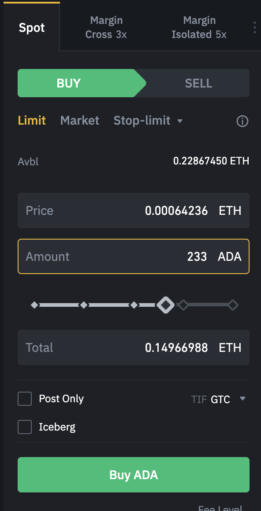

# Trade Rules
Some exchanges apply certain rules about what constitute a valid **order** to buy or sell a crypto asset. This is the struct that defines all the values representing the defined rules.

```go
type Rule struct {
	TradingPair         CurrencyPair
	BaseAssetPrecision  int
	QuoteAssetPrecision int
	MaxOrderQty         int    
	MinPriceMovement    string 
	BaseStepSize        string 
	MinNotionalValue    string 
	MinLotSize          string
}
```

The description for each rule is as follows:


## Base price step
What is a valid amount that is accepted in a trading pair. 

_**Example**: When trading ADA/ETH the base currency is **ADA**. If inside the rule the **BaseStepSize** is equal to **1**, then trying to buy **0.5** will be rejected. To be considered a valid amount only multiples of **BaseStepSize** are accepted, in this case only hole integer values are accepted since the multiplier is **1**._




_the amount of 233 ADA is valid and accepted since **233 % 1 = 0**_


